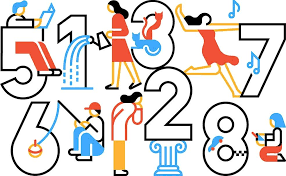

## why math?
As someone who chose to study programming because of a love for math, I often find myself wondering if mathematics can really help me break through the barriers I face in programming. When I hit a tough problem or struggle with making my code more efficient, I ask myself if my mathematical background can offer a solution.

Math has always been a passion of mine, and I’ve started to see how concepts like statistics and linear algebra can be useful in programming, even though I haven’t yet worked on data science projects. For instance, mathematical thinking helps me approach problems logically and find systematic solutions. This skill is crucial when debugging code or optimizing performance.

Moreover, math aids in breaking down complex problems into smaller, manageable parts. This analytical approach helps me understand and tackle programming challenges more effectively. Whether I’m working on a project or learning new programming concepts, the problem-solving skills honed through math are invaluable.

## Can Math Break Down the Programming Barrier?
In essence, my love for math is more than just a personal interest—it’s a key asset in overcoming programming obstacles. The logical structures, patterns, and techniques I’ve developed through math provide me with a framework to tackle complex problems in programming. When faced with challenges like breaking down difficult tasks or understanding the flow of a program, math equips me with a systematic approach, allowing me to break problems into smaller, manageable pieces. It fosters analytical thinking, which is essential for debugging, writing efficient code, and optimizing solutions.

More than that, math nurtures persistence. Just like solving a tough equation, programming requires patience, persistence, and a willingness to experiment with different strategies. This mindset has made my programming journey both more engaging and rewarding, as each challenge becomes an opportunity to apply the skills I love in math, and ultimately, to see progress. Embracing this connection between math and programming has not only helped me grow as a coder but has also made the process more fulfilling, allowing me to approach problems with both confidence and curiosity.
