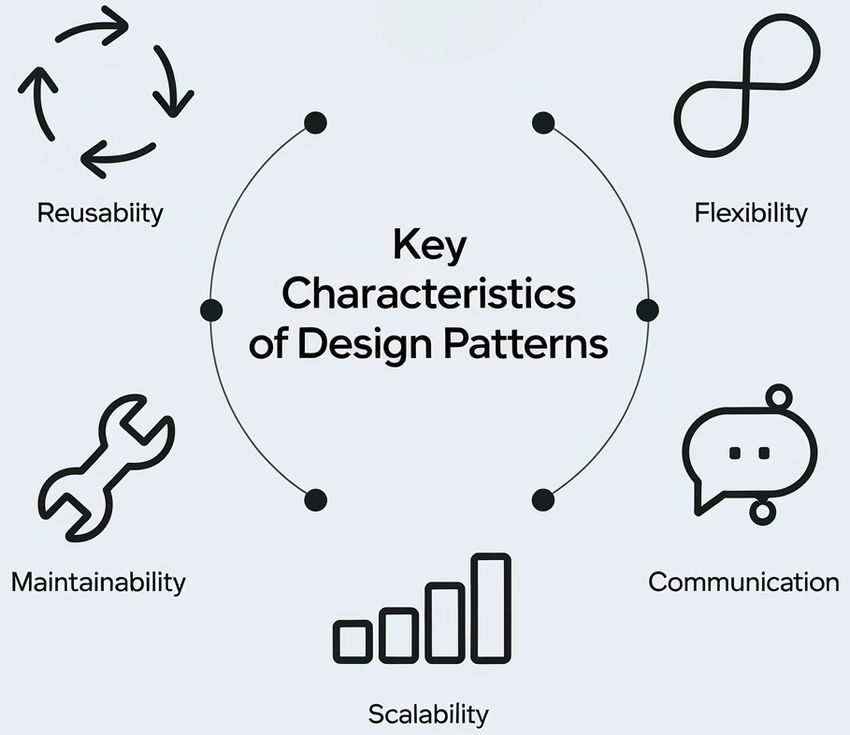

# Reflect on My Use of AI in ICS 314

## I. Introduction
AI has been like a personal tutor for me in ICS 314, helping me improve my learning experience. I mostly used ChatGPT, which was very helpful for tasks in software engineering. AI tools like this can do things like generate code or find problems in it, which lets me focus on understanding concepts. One of the best aspects of using AI was its absence of judgment—it created a safe space for learning. Unlike interacting with people, where I sometimes hesitate to ask questions out of fear of appearing ignorant or unintelligent, AI encouraged me to seek help freely. I could ask everything from simple, foundational questions to more complex ones without fear of judgment.
ChatGPT was especially invaluable due to its ability to retain conversation history, allowing me to revisit previous discussions to address recurring issues or clarify uncertainties. It gave me the freedom to take as much time as I needed to process and understand concepts, ensuring a deeper and more personalized learning experience. For instance, when I struggled with some assignments, I engaged in two- to three-hour conversations with ChatGPT. It patiently suggested different approaches, guiding me step by step to ensure I could successfully complete the tasks.

## II. Personal Experience with AI:

Experience WODs e.g. E18
I struggled with E18, particularly with the concept of functional programming. It felt overwhelming at first, so I turned to ChatGPT for help in understanding the concept. After gaining some clarity from AI, I attempted to apply the concepts on my own. I then provided AI with some of the data and asked it to generate code for me. It worked well and helped me to finish the assignment.

In-class Practice WODs
For practice WODs, I chose to use my own understanding rather than using AI. I felt it was important to develop my problem-solving abilities, and while I knew using AI might be faster, I believed that working through the problems on my own would be more valuable in the long run. Although this sometimes meant working outside of class to find answers, I found that discussing the problems with classmates was more beneficial to my learning.

In-class WODs
For WODs, I prioritized grades over skill development. When I realized I needed help, I didn't hesitate to use AI. This allowed me to finish tasks more quickly, but it also came with a cost: I had to be cautious in evaluating and correcting AI-generated code to ensure its correctness.

Essays
For essays, I mostly came up with my own ideas and writing. However, I used AI to generate suggestions and ask for rewrites, particularly to ensure my work was free of errors. For instance, I would ask, “Help me rewrite this without errors and suggest better words.” As a person who’s first language is not english this was very useful

Final project
For the final project, I aimed to use the class material as much as possible, but when I ran into debugging issues, I would copy and paste my code into AI and ask, "What's wrong with my code?" Sometimes it provided immediate help, but other times it took longer to pinpoint the problem, especially if the issue wasn’t confined to just one file. Additionally, we used GPT to help create our team agreement dox, which turned out to be a successful and efficient way to get started on the project.

Learning a concept / tutorial
When I encountered difficulties understanding certain concepts, I used ChatGPT to break them down. AI was useful in simplifying the material, but occasionally, it oversimplified things. In those cases, I kept asking follow-up questions until I understood the concept correctly.
Answering a question in class or in Discord
I didn’t use AI to answer questions in class or on Discord, mainly because I found that AI often used complex language that I didn’t fully understand. I felt it was more effective for me to answer questions based on my own understanding.

Asking or answering a smart-question
I did not use AI when asking or answering smart questions. When I asked questions, I knew the issues I was facing and could explain them clearly. Similarly, when answering questions, I felt that I could provide a more detailed and helpful explanation in my own words.

Coding example e.g. “give an example of using Underscore .pluck”
For coding examples, I frequently turned to ChatGPT, as it provided various examples at different levels. This helped me understand how to apply a function in real-world coding scenarios.

Explaining code
I also relied on AI to explain code when I had trouble understanding it. ChatGPT was helpful in answering all my questions, and I never felt judged for asking basic questions.

Writing code
For writing code I tried it by myself then asked AI at times for its speed. However, I found that it sometimes overcomplicated the solution. In such cases, I would rewrite the code to make it more efficient or easier to understand.

Documenting code
For documenting code, I typically wrote my own documentation and then asked ChatGPT to refine it. This helped me ensure the documentation was more formal and error-free.

Quality assurance e.g. “What’s wrong with this code” or “Fix the ESLint errors in code”
I used AI to find issues in my code, and it often provided the correct solution quickly. However, I struggled when the problem involved multiple interconnected files, as AI couldn’t always pinpoint the issue in such complex cases.

Other uses in ICS 314 not listed
I faced challenges with using the terminal, which was a crucial tool for most of the work we did this semester. I was not familiar with it at all, especially when it came to npm and npx commands, which were confusing at first. ChatGPT was incredibly helpful in improving my understanding of these concepts. Whenever I encountered errors, I would copy and paste the error messages into ChatGPT, and it would provide various solutions to try, which helped me work through the issues.

## III. Impact on Learning and Understanding:
The incorporation of AI has enhanced my learning experience in ICS 314. It has had a profound impact on my comprehension, skill development, and problem-solving abilities. AI tools, particularly ChatGPT, provided me with immediate assistance, which allowed me to better understand complex software engineering concepts. For example, when I struggled with topics like functional programming, ChatGPT offered detailed explanations and examples that helped clarify my doubts. This allowed me to approach problems with greater confidence and made difficult concepts more accessible.
AI also played a key role in my skill development by offering step-by-step guidance and alternative solutions to problems. While this allowed me to complete assignments more efficiently, it also encouraged me to think critically about the solutions provided and refine them for better understanding. In terms of problem-solving, AI helped me break down complex issues into manageable steps, improving my approach to debugging and code refinement. However, I found that it sometimes overcomplicated solutions, requiring me to simplify or rethink the approach, which also contributed to my growth as a developer.

## IV. Practical Applications:
AI has practical uses beyond the classroom, especially in real-world software engineering projects, simulations, and collaborative activities. In the industry, AI tools are being used more to automate tasks like code generation, detect bugs, and optimize development workflows. For example, tools like GitHub Copilot and AI-powered code editors help developers by suggesting code, speeding up coding tasks, and saving time on repetitive work. These tools are particularly helpful in large projects, where getting things done quickly and accurately is crucial.

## V. Challenges and Opportunities:
Using AI in ICS 314 was helpful, but it also came with some challenges. Sometimes, AI would give solutions that were more complicated than needed, which meant I had to simplify them to make them work. Another issue was that AI struggled to understand problems that involved multiple files or required a deeper understanding of the project’s overall structure. Also, I found that relying too much on AI sometimes held me back from building my own problem-solving skills. I would often go straight to AI for answers instead of figuring things out on my own.
These challenges also bring opportunities for improvement. For example, AI could be more involved in the software engineering course by helping students practice critical thinking and debugging skills. It could also give instant feedback on code, showing students their mistakes and helping them learn better coding habits. If AI is used alongside hands-on problem-solving, students can grow into stronger developers without becoming too dependent on AI for every solution.

## VI. Comparative Analysis:
Traditional teaching methods and AI-enhanced learning each bring unique strengths to education. Traditional methods, such as lectures and hands-on activities, provide a structured approach that helps students build foundational knowledge and skills. They encourage engagement through direct interaction with instructors and peers, as well as guided problem-solving. In contrast, AI-enhanced learning offers a more personalized and flexible experience, allowing students to seek help anytime and tailoring responses to individual learning styles. This flexibility makes AI a valuable tool for addressing specific needs and providing support that isn’t always available in traditional settings.
However, there are potential downsides to relying too much on AI. While it excels at offering real-time feedback and filling gaps in understanding, it can also tempt students to overuse it. This could lead to situations where students pass their courses but fail to fully grasp the material because AI handled much of the work for them. Balancing both approaches—using AI for immediate assistance while leveraging traditional methods for deep, long-term learning—can ensure students develop both practical skills and a strong understanding of the subject.

## VII. Future Considerations:
Looking ahead, AI will increasingly shape software engineering education, particularly in areas like debugging, code generation, and collaboration. However, it's essential to ensure that students do not become overly reliant on AI. AI should be a complementary tool that encourages critical thinking and problem-solving, rather than a shortcut that bypasses deeper learning. It is crucial that students engage with AI in ways that promote independent thinking, such as guiding them through debugging processes while still encouraging them to analyze and make decisions.
In the future, AI could enhance various aspects of software engineering education, such as testing, deployment, and team collaboration, fostering a mindset of active learning. As AI continues to advance, it may also enable more immersive learning experiences, like AI-powered simulations that provide real-time feedback on coding practices. These simulations could offer students the opportunity to tackle real-world software engineering challenges, making learning more hands-on and practical.

## VIII. Conclusion:
In conclusion, my use of AI in ICS 314 has greatly enhanced my learning experience by providing immediate, personalized assistance and enabling me to better understand complex concepts. ChatGPT, in particular, helped me navigate challenging topics like functional programming, offered guidance on assignments, and facilitated debugging. While I found AI useful for speeding up problem-solving and offering alternative solutions, I also recognized the importance of not becoming overly reliant on it. It is crucial to balance AI usage with independent problem-solving to ensure deeper learning and skill development.

Looking ahead, AI will continue to play a significant role in software engineering education. However, it is essential that AI serves as a tool to support critical thinking and problem-solving, rather than replacing these fundamental skills. By integrating AI into the learning process in a way that encourages active engagement, students can benefit from its capabilities while developing a solid understanding of the material. As AI technology advances, it holds the potential to create more immersive and hands-on learning experiences, preparing students to tackle real-world software engineering challenges.

