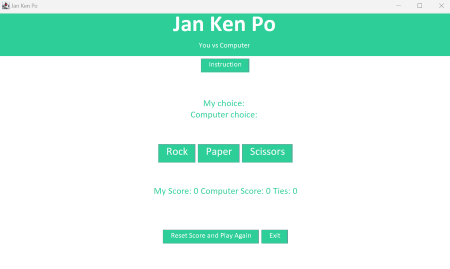
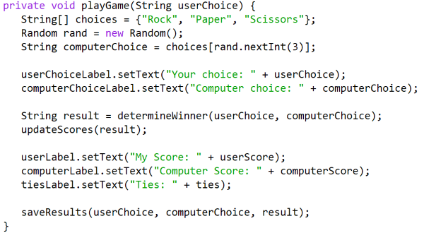

JanKenPo is a rock paper scissor playing programm that I made in ICS211, Fall 2023. This project helped me understand how to build graphical user interfaces (GUIs) and implement event-driven programming.

The game is a digital version of the classic Rock-Paper-Scissors game, implemented using Java's Swing library. It features a simple and intuitive interface where players can choose between Rock, Paper, or Scissors and compete against a computer opponent. The application keeps track of scores, displays the results, and allows players to reset the game at any time.

In this project, I gained hands-on experience with GUI design in Java, event handling, and file I/O operations. I also learned how to manage the state of a game and update the user interface based on user interactions. Additionally, I practiced basic file handling by saving game results to a text file, which can be used for later analysis or review.

Here is an example of the Java code I wrote to handle the game's logic and user interactions:

