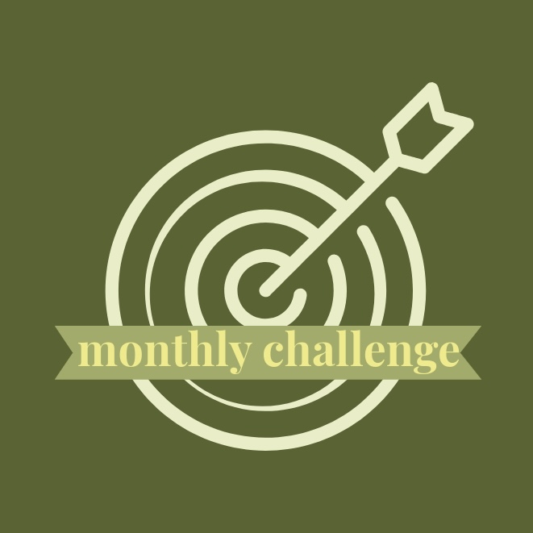

  
  
  

  This webpage is designed to showcase a career map, assist in studying Computer Science by suggesting monthly programming goals, and help people find friends who want to study together or start projects together. For this project, I plan to revisit my HTML and JavaScript skills while learning CSS, API, HTTP, Next.js, and SQL. This project will help me learn how to design and implement a responsive website.

  In this project, I will be gaining valuable experience in web development. Through the project, including HTML and JavaScript for both client-side programming, CSS for styling, API integration for dynamic data handling, and SQL for database management. Additionally, I will work with Next.js to develop a responsive and modern user interface. This project will also enhance my understanding of HTTP protocols, and help me build a responsive, user-friendly website.

To see my ongoing project, click [here](https://github.com/mermaid-min/myCSnote.git).
