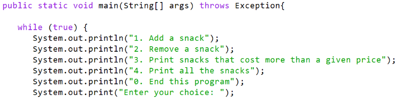

I created a Vending Machine program using Java as part of my ICS project in Fall 2023. This project was designed to help me understand object-oriented programming, handling arrays, and using basic exception handling. The goal was to build a console-based vending machine that allows users to add, remove, and display snacks.

The Vending Machine uses an array to store snack objects, with each snack having attributes like barcode, price, calories, and name. I implemented a menu-based system where users can interact with the vending machine by adding or removing snacks, printing all snacks, or filtering based on price. This project helped me grasp concepts like input validation through InputMismatchException and managing duplicates by checking for matching barcodes before adding snacks.

Through this project, I deepened my understanding of array manipulation, exception handling, and user input processing in Java.

Here is an example of the Java code I wrote to handle the vending machine's logic and user interactions:

